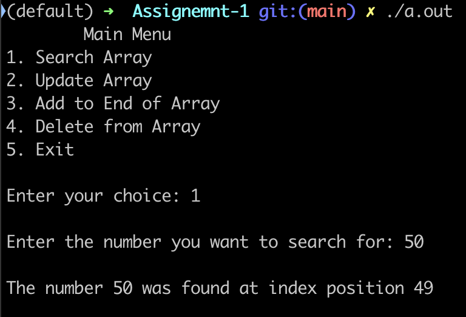
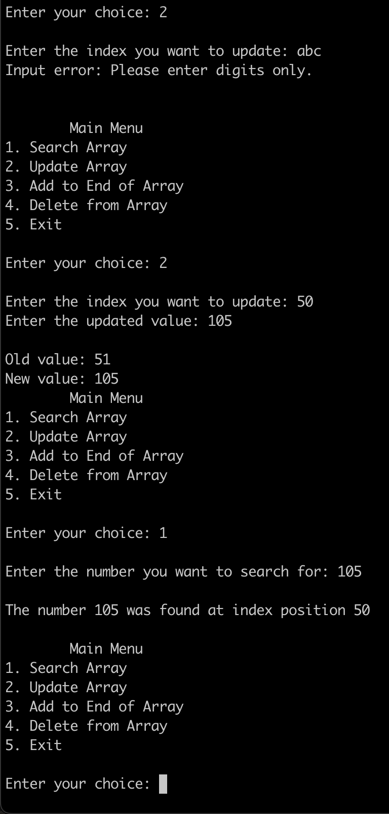
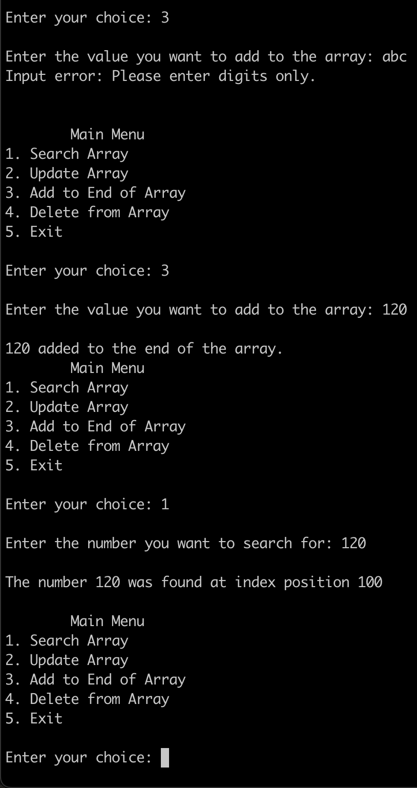
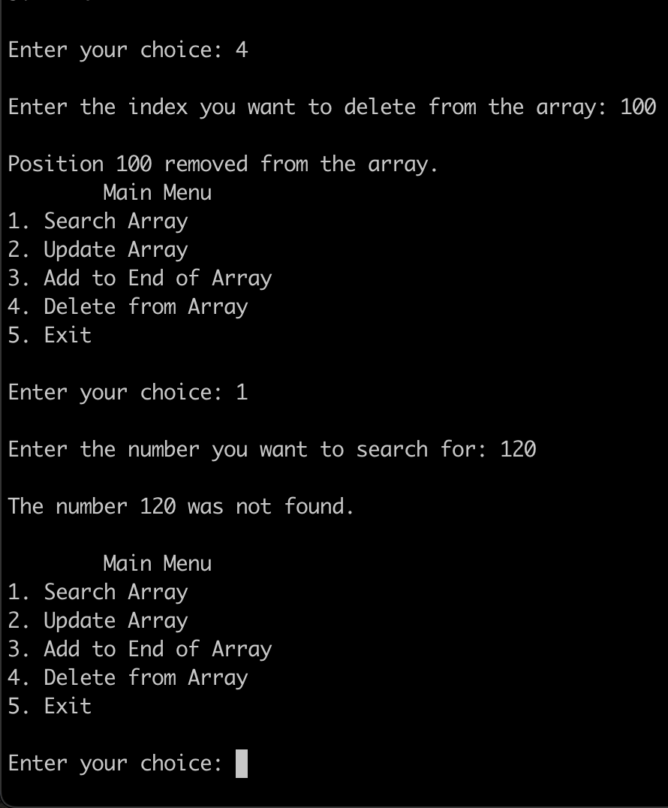

# CS303-Assignment1

## Files

- `main.cpp` – Contains the `main()` function and overall program flow
- `functions.h` – Contains function declarations and the `UpdateResult` struct
- `A1input.txt` – Text file containing the initial values for the array (one number per line)

---

## Functions Overview

### Search for a number in the array

### Update a value at a specific index

### Add a new number to the end of the array

### Delete a value at a specific index

---

### Exit the program from the main menu

(The program exits when the user selects option `5`)
